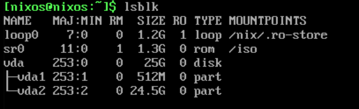

# NixOS Installation with niri Window Manager

This repository contains a declarative NixOS configuration with the niri scrollable-tiling Wayland compositor.

## 0. Prerequisites

- A machine booted from NixOS minimal live ISO
- \[OPTIONAL\] [[SSH Access from Host to VM]] for easier administration and copy-pasting of commands.

## 1. Disk partitioning

We will use [[GPT]] partitioning scheme with an [[EFI System Partition (ESP)]] for [[UEFI boot|UEFI booting]].

### Use [[lsblk]] to see current disk layout

```bash
$ lsblk
```


### Desired Target State

| Partition | Device    | Size      | Type            | Format | Label   | Mount Point | Purpose                    |
|-----------|-----------|-----------|-----------------|--------|---------|-------------|----------------------------|
| ESP       | /dev/vda1 | 1G        | EFI System      | FAT32  | boot    | /boot       | UEFI boot files            |
| Swap      | /dev/vda2 | 4G        | Linux swap      | swap   | swap    | [SWAP]      | Memory swap space          |
| Root      | /dev/vda3 | Remaining | Linux filesystem| ext4   | nixos   | /           | Root filesystem            |

### Partitioning with [[Disko]]

Instead of manual partitioning with [[cfdisk]], we'll use disko for declarative disk management:

```bash
# Switch to root user
sudo -i

# Load git and disko to Nix shell
nix-shell -p git disko

# Clone this repository
cd /tmp
git clone https://github.com/xfusek08/dotfiles-niri.git
git checkout nixos

# Apply the disko configuration
disko --mode disko --config /tmp/dotfiles-niri/disk-config.nix
```

This will automatically:
- Create the GPT partition table
- Create all three partitions with correct types
- Format them with the specified filesystems
- Mount them at the appropriate locations
- Enable swap

Verify the result with:
```bash
lsblk
```

Expected output:
```
NAME   MAJ:MIN RM  SIZE RO TYPE MOUNTPOINTS
vda    253:0    0   50G  0 disk
├─vda1 253:1    0    1G  0 part /mnt/boot
├─vda2 253:2    0    4G  0 part [SWAP]
└─vda3 253:3    0   45G  0 part /mnt
```
