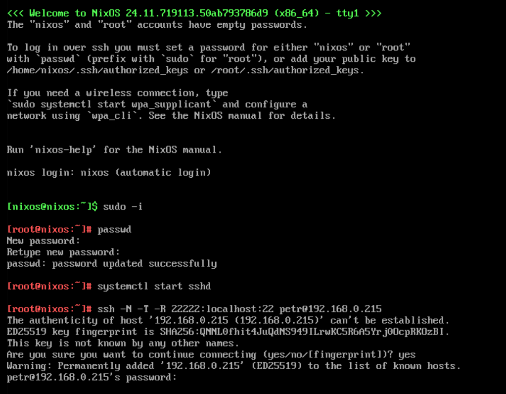

# SSH Access from Host to VM

> - _Source: https://bytefreaks.net/gnulinux/an-easy-way-to-ssh-into-a-gnome-boxes-os_
> - _Generated by GitHub Copilot using Claude Sonet 4.5 model._

---

To make administration easier, you can SSH into the VM from your host machine using reverse SSH tunneling. This is particularly useful when working with NixOS minimal live ISO where configuring network interfaces is not straightforward.

### Enable SSH on Both Machines

**Important:** SSH service must be running on both the host and the VM.

#### On the VM (NixOS Minimal Live ISO):

By default, the NixOS live ISO runs as the `nixos` user. Switch to root and set a password:

```bash
# Switch to root
sudo -i

# Set a password for root (required for SSH)
passwd

# Start SSH service
systemctl start sshd
```

Note: The live ISO doesn't persist changes, so `enable sshd` is not necessary.

#### On the Host:
```bash
# For systemd-based distributions (most modern Linux)
sudo systemctl start sshd
sudo systemctl enable sshd

# Verify SSH is running
sudo systemctl status sshd
```

### Setup Reverse SSH Tunnel

1. Get your host machine's IP address (from the host):
```bash
ip addr show
# or
hostname -I
```

2. From the VM terminal (as root), create the reverse SSH tunnel:
```bash
ssh -N -T -R 22222:localhost:22 host_username@host_ip_address
```

**SSH Parameters Explained:**
- `-N` - Do not execute a remote command (just forward ports)
- `-T` - Disable pseudo-terminal allocation
- `-R 22222:localhost:22` - Forward port 22222 on the host to port 22 on the VM

This command will block the terminal as it maintains an active connection.

3. From the host machine, SSH into the VM as root:
```bash
ssh -p 22222 root@localhost
```

### Notes

**Advantages:**
- Easy to set up
- No need to configure virtual network interfaces
- Works immediately with Gnome Boxes
- Perfect for NixOS installation process

**Disadvantages:**
- Requires SSH server running on the host machine
- The tunnel connection must remain active
- Need to re-establish the tunnel after VM restarts
- Password must be set on the live ISO each boot


